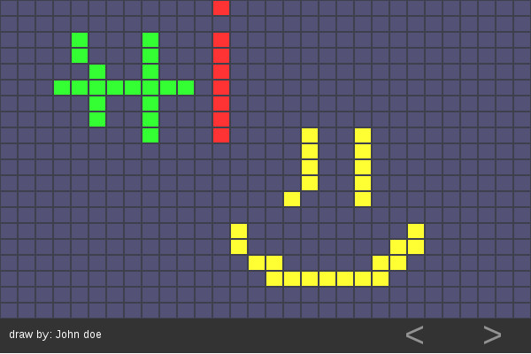

# squarebook

This is a drawing guestbook, visitors of your site can leave you a drawing.

```
npm install squarebook --save
```

Squarebook can be imported as node package, example:

```
import squarebook from 'squarebook';

squarebook({
  container: document.getElementById('container'),
  getDataUrl:'http://localhost:3000/getData',
  postDataUrl: 'http://localhost:3000/postData'
})

```

The configuration requires a getDataUrl and postDataUrl, an example of server side can be found at example/ directory.

Try the example by cloning this repository then:

```
npm install
cd example/server
npm install
node index.js
```
And open example/index.html in your browser

It looks like this:


